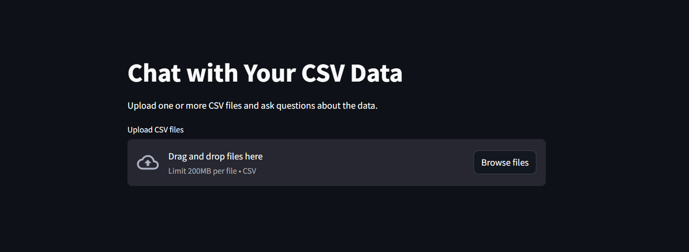
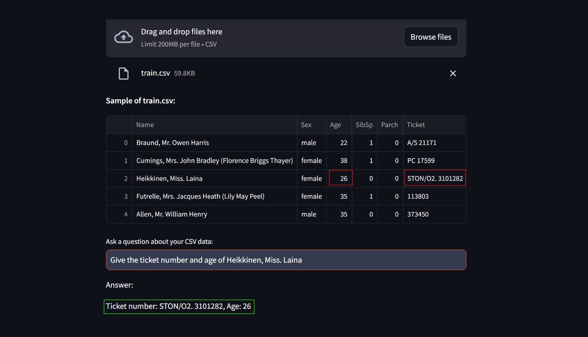

# CSV Chat App: Interact with Your CSV Data

The **CSV Chat App** allows users to upload one or more CSV files, view a sample of the data, and ask questions about the data using natural language. The app uses the **LangChain** framework and **OpenAI's GPT** model to provide intelligent answers based on the uploaded data.


## Features

- **File Upload**: Users can upload multiple CSV files at once.
- **Data Preview**: Displays a sample (first five rows) of each uploaded CSV file.
- **Question Interface**: Users can ask questions about the data, and the app uses AI to provide insights or answers.
- **LangChain Agent**: A powerful agent is created to interact with the uploaded CSVs using OpenAI's GPT model.
  

## Installation

1. **Clone the Repository**

    ```bash
    git clone https://github.com/bhargav0807/ChatWithCSVs.git
    cd ChatWithCSVs
    ```

2. **Create a Virtual Environment**

    It's recommended to create a virtual environment to isolate your dependencies.

    ```bash
    python3 -m venv venv
    source venv/bin/activate  # On Windows use `venv\Scripts\activate`
    ```

3. **Install the Required Packages**

    Install the dependencies listed in the `requirements.txt` file.

    ```bash
    pip install -r requirements.txt
    ```

4. **Set Up Environment Variables**

    Create a `.env` file in the project root and add your OpenAI API key.

    Example `.env` file:

    ```env
    OPENAI_API_KEY=your_openai_api_key
    ```

## Usage

1. **Start the Streamlit App**

    Use the following command to start the Streamlit app locally:

    ```bash
    streamlit run app.py
    ```

    This will launch the app on `http://localhost:8501`.

2. **Uploading CSV Files**

    - After launching the app, you can upload one or more CSV files using the file uploader.
    - Once a CSV is uploaded, a sample of the data (first five rows) will be displayed.

3. **Asking Questions**

    - You can ask questions about the uploaded data in the text box.
    - The LangChain agent, powered by OpenAI's GPT, will process your question and return an answer based on the data.
